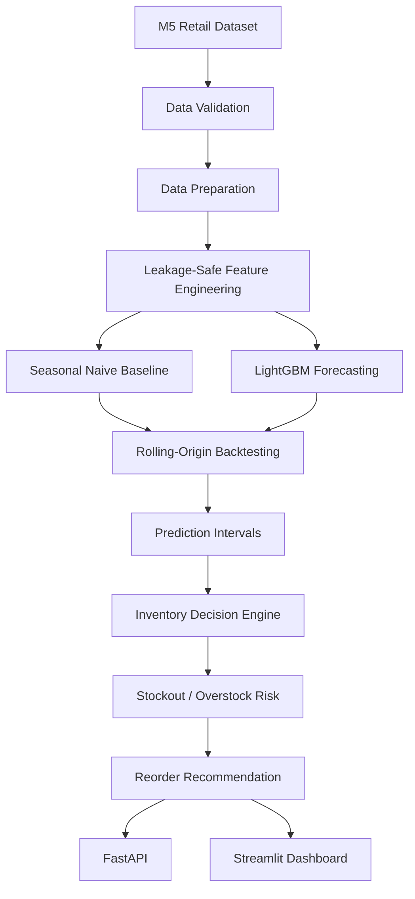

# Retail Demand Forecasting & Inventory Decision Engine

A production-style retail forecasting portfolio project built on the real **M5 Forecasting — Walmart** dataset.

Repository target: `https://github.com/Alif1642/retail-demand-forecasting-inventory`. It forecasts SKU/store demand and translates forecasts plus uncertainty into operational inventory recommendations.

> Results are generated after running the pipeline on the local M5 dataset.

## Project Overview

The repository demonstrates an end-to-end workflow: real M5 data ingestion, memory-aware preparation, leakage-safe feature engineering, a 7-day seasonal-naive benchmark, LightGBM forecasting, rolling-origin backtesting, residual-based prediction intervals, inventory decision rules, an API, a Streamlit dashboard, tests, notebooks, containers, and CI.

## Business Problem

Retail teams need more than point forecasts. They need a decision layer that answers whether inventory is likely to stock out, whether it is excessive, where the reorder point lies, and how many units should be ordered under a chosen service level and lead time.

## Dataset

The project uses the M5 Forecasting Walmart retail dataset. Source CSVs are not committed to Git.

## Dataset Setup

Place the downloaded files under `data/raw/m5/` as described in [docs/data_setup.md](docs/data_setup.md).

Expected files:

```text
calendar.csv
sales_train_validation.csv
sales_train_evaluation.csv
sell_prices.csv
sample_submission.csv
```

Default laptop-friendly configuration:

```text
DATA_MODE=sample
MAX_SERIES=100
```

Full mode:

```text
DATA_MODE=full
```

## Architecture



See [docs/architecture.md](docs/architecture.md).

## Data Pipeline

1. Validate expected M5 files and keys.
2. Load sales, calendar, and price data with memory-conscious dtypes.
3. In sample mode, select real sales series and chunk-filter the price table.
4. Convert M5 `d_*` sales columns from wide to long format.
5. Merge calendar and sell-price data.
6. Save local processed data to `data/processed/m5_prepared.csv`.

## Feature Engineering

Features include:

- lags: 1, 2, 3, 7, 14, 28, 56 days
- rolling means: 7, 14, 28, 56 days
- rolling standard deviations: 7 and 28 days
- day-of-week, week, month, quarter, year
- weekend/month boundary indicators
- event and SNAP indicators
- current/previous price, absolute and percentage change, rolling average price, relative price
- stable numeric identifiers for SKU/store hierarchy fields

## Leakage Prevention

Demand rolling statistics use `shift(1)` before rolling windows. Chronological validation is used throughout. Recursive forecasting starts with future demand missing, predicts one day, appends that prediction, and only then computes the next day.

## Seasonal Naive Baseline

A 7-day seasonal-naive forecast provides the benchmark. For horizons longer than one week, the latest weekly pattern is repeated recursively without reading actual validation demand.

## LightGBM Forecasting

LightGBM is the primary machine-learning model. The default forecast horizon is 28 days and can be changed through configuration or command-line options.

## Time-Series Backtesting

Rolling-origin backtesting defaults to three 28-day folds. Outputs include fold-level MAE, WMAPE, RMSSE, bias, interval coverage, means, standard deviations, and best/worst fold by MAE.

## Prediction Intervals

Prediction intervals are generated from empirical signed validation residual quantiles. The pipeline also reports empirical interval coverage and average interval width.

## Inventory Decision Engine

The engine consumes forecast paths, uncertainty bounds, current inventory, lead time, service level, holding cost, and stockout cost. It returns expected demand, safety stock, reorder point, recommended order quantity, stockout/overstock risk, priority score, and recommendation.

## Safety Stock

```text
Safety Stock = Z × Demand Std × sqrt(Lead Time)
```

Supported service levels are 90%, 95%, and 99%.

## Reorder Point

```text
Reorder Point = Expected Lead-Time Demand + Safety Stock
```

## Stockout Risk

Risk boundaries are tied to expected lead-time demand and the reorder point. See [docs/inventory.md](docs/inventory.md).

## Overstock Risk

Overstock risk is based on units above the upper forecast bound and normalized holding-cost exposure. See [docs/inventory.md](docs/inventory.md).

## Evaluation Metrics

- MAE
- WMAPE
- RMSSE with historical scaling
- forecast bias
- prediction-interval coverage
- average interval width

Exact formulas are documented in [docs/evaluation.md](docs/evaluation.md).

## Dashboard

The Streamlit dashboard includes forecast overview, actual vs forecast charts, SKU/store drilldown, inventory decision controls, risk ranking, and model performance. Visuals use Matplotlib.

```powershell
streamlit run dashboard/streamlit_app.py
```

## API

Endpoints:

```text
GET  /health
GET  /models
GET  /products
GET  /forecast/{series_id}
POST /forecast
POST /inventory/recommendation
POST /backtest
GET  /metrics
```

Example request body:

```json
{
  "series_id": "HOBBIES_1_001_CA_1",
  "horizon": 28
}
```

Run the API with the included ASGI server:

```powershell
hypercorn api.main:app --bind 0.0.0.0:8000
```

Interactive API documentation is available at `/docs` while the service is running.

## Jupyter Notebooks

The notebooks are runnable guides that import reusable functions from `src/` instead of duplicating production logic:

1. data understanding
2. data preparation
3. feature engineering
4. baseline forecasting
5. LightGBM forecasting
6. time-series backtesting
7. inventory decision engine
8. model evaluation

### Jupyter Setup

```powershell
pip install jupyter notebook ipykernel
python -m ipykernel install --user --name retail-forecast-env --display-name "Python (Retail Forecast)"
```

In VS Code, open a notebook, click the kernel selector in the upper-right, choose **Select Another Kernel**, then choose **Python (Retail Forecast)**.

## Installation

### Windows Setup

```powershell
python -m venv .venv
Set-ExecutionPolicy -Scope Process -ExecutionPolicy Bypass
.\.venv\Scripts\Activate.ps1
python -m pip install --upgrade pip
pip install -r requirements.txt
```

## Data Validation

```powershell
python scripts/validate_data.py
```

The command reports file availability, table shapes, memory use, missing values, calendar date range, series count, store count, and product count.

## Data Preparation

```powershell
python scripts/prepare_data.py
```

## Training

```powershell
python scripts/train_model.py
```

Training performs a chronological holdout, trains LightGBM, evaluates the holdout, saves the native model, model metadata, feature columns, validation residuals, and generated metrics.

## Backtesting

```powershell
python scripts/run_backtest.py
```

Output:

```text
results/metrics/backtest_results.csv
```

## Forecasting

```powershell
python scripts/generate_forecast.py --series-id HOBBIES_1_001_CA_1
```

Optional horizon:

```powershell
python scripts/generate_forecast.py --series-id HOBBIES_1_001_CA_1 --horizon 28
```

## Inventory Recommendations

```powershell
python scripts/run_inventory_engine.py
```

For real current-inventory inputs, provide a CSV:

```powershell
python scripts/run_inventory_engine.py --inventory-file path\to\inventory.csv
```

Expected optional inventory columns:

```text
series_id,current_inventory,lead_time,service_level,holding_cost,stockout_cost
```

Without that file, the script uses zero current inventory as an explicit operational input assumption; it does not fabricate measured inventory levels.

## Testing

Tests use tiny manually-created data frames and do not require the M5 dataset or expensive training.

```powershell
python -m unittest discover -v
```

## Docker

The raw M5 directory is mounted at runtime rather than copied into the image.

```powershell
docker compose up --build
```

## Limitations

- M5 full mode can require substantial memory because wide-to-long expansion is large.
- Residual-based intervals are empirical and should be monitored for coverage drift.
- Inventory recommendations depend on supplied inventory, lead-time, and cost assumptions.
- The hierarchy module implements aggregation and a basic bottom-up interface, not advanced reconciliation optimization.
- Price features are predictive inputs; the project does not infer causal price effects.

## Future Improvements

- distributed or partitioned full-dataset preparation
- richer model tuning under strict chronological validation
- per-segment uncertainty calibration
- richer inventory policies with supplier constraints and minimum order quantities
- advanced hierarchy reconciliation with explicit benchmark comparisons
- automated data-quality and drift monitoring

## Resume Description

> Developed SKU-store demand forecasting pipelines using leakage-safe lag/rolling features and LightGBM with rolling-origin backtesting for 28-day retail demand prediction.
>
> Converted demand forecasts and uncertainty estimates into inventory decisions including safety stock, reorder points, stockout/overstock risk, and reorder priorities.

## LinkedIn Description

> Built a retail forecasting system that goes beyond prediction by translating SKU/store demand forecasts into operational inventory decisions. The system combines leakage-safe time-series validation, gradient-boosted forecasting, uncertainty intervals, and an interactive dashboard/API for inventory decision support.

## Reproducibility Notes

Generated processed data, models, predictions, and result files are ignored by Git. Source M5 CSVs and local environment files are also excluded. Repository metrics are intentionally not pre-populated: run the pipeline on your local dataset to produce actual values.
