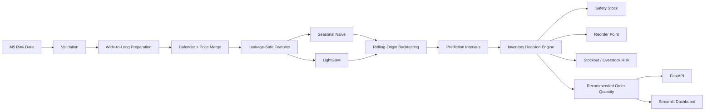

# Retail Demand Forecasting & Inventory Decision Engine

<p align="center">
  <strong>End-to-end retail demand forecasting that turns predictions into inventory decisions.</strong>
</p>

<p align="center">
  Built with real M5 Walmart data, leakage-safe time-series features, LightGBM, rolling-origin backtesting, uncertainty intervals, FastAPI, Streamlit, Docker, and CI.
</p>

<p align="center">
  <a href="https://github.com/Alif1642/retail-demand-forecasting-inventory/actions/workflows/ci.yml">
    
  </a>
  
  
  
  
  
  
  
</p>

---

## Overview

Retail forecasting is only useful when it supports an operational decision.

This project builds a complete forecasting workflow around the real **M5 Forecasting — Walmart** dataset and converts SKU/store-level demand predictions into inventory recommendations such as:

- **How much demand is expected over the next 28 days?**
- **How uncertain is that forecast?**
- **Is current inventory likely to stock out?**
- **Is inventory excessive relative to forecast demand?**
- **Where should the reorder point be?**
- **How much should be reordered?**
- **Which SKU/store combinations should be prioritized first?**

The repository is designed as a **portfolio-grade, production-style machine learning project**, not a single exploratory notebook.

> **Data policy:** the original M5 CSV files, generated models, predictions, and processed datasets are intentionally excluded from Git. Results are produced locally from the real dataset.

---

## Why This Project Stands Out

This project demonstrates more than model training:

| Capability | Implementation |
|---|---|
| Real-world dataset | M5 Forecasting Walmart retail data |
| Forecast granularity | SKU × store |
| Forecast horizon | 28 days by default |
| Baseline | 7-day Seasonal Naive |
| ML model | LightGBM |
| Leakage prevention | Lagged demand + shifted rolling windows |
| Validation | Chronological holdout + rolling-origin backtesting |
| Metrics | MAE, WMAPE, RMSSE, Bias |
| Uncertainty | Residual-based prediction intervals |
| Inventory logic | Safety stock, reorder point, reorder quantity |
| Risk layer | Stockout risk + overstock risk |
| Serving | FastAPI |
| Visualization | Streamlit + Matplotlib |
| Testing | Python `unittest` |
| Containers | Docker + Docker Compose |
| CI | GitHub Actions |
| Reproducibility | Sample mode + full-data mode |

---

## Verified Results — Local Sample Mode

The following numbers were generated from a real local run using:

```text
DATA_MODE=sample
MAX_SERIES=100
FORECAST_HORIZON=28
N_BACKTEST_FOLDS=3
```

### Data Verification

| Item | Verified value |
|---|---:|
| Sample series | 100 |
| Stores represented | 1 |
| Products represented | 100 |
| Prepared rows | 194,100 |
| Raw M5 date range | 2011-01-29 → 2016-06-19 |
| Prepared history end | 2016-05-22 |
| Forecast horizon | 28 days |

### 3-Fold Rolling-Origin Backtest

| Metric | Seasonal Naive | LightGBM | Change |
|---|---:|---:|---:|
| **MAE** | 1.388 | **1.010** | **27.3% lower** |
| **WMAPE** | 1.156 | **0.840** | **27.4% lower** |
| **RMSSE** | 1.086 | **0.864** | **20.4% lower** |
| **Bias** | -0.035 | -0.523 | LightGBM under-forecasts |
| **Interval Coverage** | — | **0.900** | Target ≈ 0.90 |

LightGBM outperformed the Seasonal Naive benchmark on **MAE, WMAPE, and RMSSE in all three folds**.

At the same time, the negative LightGBM bias is intentionally reported rather than hidden: the model shows a consistent **under-forecasting tendency**, which is a clear candidate for future bias correction or calibration work.

### Validation Snapshot

```text
MAE                   1.0359
WMAPE                 0.8356
RMSSE                 0.8724
Bias                  -0.5464
Interval Coverage      0.9164
Average Interval Width 3.5023
```

> These are **sample-mode verification results**, not full-M5 benchmark claims. Full-mode results depend on the machine, configuration, and complete local pipeline run.

---

## Example Forecast & Inventory Decision

A verified 28-day forecast was generated for:

```text
HOBBIES_1_001_CA_1
```

Forecast window:

```text
2016-05-23 → 2016-06-19
```

The resulting inventory-engine smoke test produced:

| Output | Value |
|---|---:|
| 28-day expected demand | 22.41 |
| Current inventory | 0.00 |
| Safety stock | 5.31 |
| Reorder point | 11.94 |
| Recommended order quantity | 27.72 |
| Stockout risk | **HIGH** |
| Overstock risk | **LOW** |
| Priority score | 69.54 |
| Recommendation | **REORDER** |

The zero inventory value above is an explicit test input, not a measured business inventory level.

---

## System Architecture



---

## Repository Structure

```text
retail-demand-forecasting-inventory/
│
├── api/                         # FastAPI application and routes
├── dashboard/                   # Streamlit dashboard
├── data/
│   ├── raw/m5/                  # Local M5 CSVs (ignored by Git)
│   ├── processed/               # Prepared data (ignored)
│   ├── features/                # Generated feature artifacts
│   └── predictions/             # Forecast/inventory outputs
│
├── docs/                        # Architecture and methodology docs
├── models/                      # Generated LightGBM artifacts (ignored)
├── notebooks/                   # Eight runnable analysis notebooks
├── results/
│   ├── metrics/
│   ├── figures/
│   └── reports/
│
├── scripts/                     # CLI pipeline entry points
├── src/
│   ├── data/
│   ├── evaluation/
│   ├── features/
│   ├── forecasting/
│   ├── hierarchy/
│   ├── inventory/
│   └── utils/
│
├── tests/                       # unittest test suite
├── .github/workflows/ci.yml     # Continuous integration
├── .dockerignore
├── .env.example
├── .gitignore
├── Dockerfile
├── docker-compose.yml
├── requirements.txt
├── README.md
└── LICENSE
```

---

## Data Pipeline

The raw M5 sales table is stored in wide format (`d_1`, `d_2`, …). The preparation pipeline converts it into a forecasting-friendly long format:

```text
id
item_id
dept_id
cat_id
store_id
state_id
date
demand
```

It then merges:

1. sales history,
2. calendar information,
3. event/SNAP information,
4. weekly selling prices.

The processed dataset is written locally to:

```text
data/processed/m5_prepared.csv
```

---

## Leakage-Safe Feature Engineering

Time-series leakage prevention is a core design constraint.

### Demand Lags

```text
lag_1
lag_2
lag_3
lag_7
lag_14
lag_28
lag_56
```

### Rolling Features

```text
rolling_mean_7
rolling_mean_14
rolling_mean_28
rolling_mean_56
rolling_std_7
rolling_std_28
```

Rolling statistics use:

```python
series.shift(1).rolling(...)
```

This ensures the current target and future demand do not leak into the feature window.

### Calendar Features

- day of week
- week
- month
- quarter
- year
- weekend flag
- month-start / month-end
- events
- SNAP indicators

### Price Features

- current price
- previous price
- absolute price change
- percentage price change
- rolling average price
- relative price

Price features are treated as predictive inputs. The project does **not** make causal claims about price effects.

---

## Forecasting Strategy

### 1. Seasonal Naive Baseline

A 7-day seasonal pattern is used as the benchmark.

For horizons beyond one week, the historical weekly pattern is repeated recursively without reading future actual demand.

### 2. LightGBM

LightGBM is trained on lag, rolling, calendar, event, hierarchy, and price features.

The project deliberately avoids random shuffled train/test splitting.

### 3. Chronological Validation

```text
Past ----------------------------------------------> Future

[                    Training                    ][Validation]
```

### 4. Rolling-Origin Backtesting

```text
Fold 1: [ Training ---------------- ] [28-day validation]
Fold 2: [ Training ---------------------- ] [28-day validation]
Fold 3: [ Training ---------------------------- ] [28-day validation]
```

This tests the model across multiple forecast origins instead of relying on one split.

### 5. Recursive Forecasting

For every future day:

```text
available history
      ↓
build features
      ↓
predict next day
      ↓
append prediction
      ↓
build next-day features
      ↓
repeat
```

Actual future demand is never used during inference.

---

## Evaluation Metrics

### MAE

```text
mean(|actual - forecast|)
```

### WMAPE

```text
sum(|actual - forecast|) / sum(|actual|)
```

### Forecast Bias

```text
sum(forecast - actual) / sum(actual)
```

### RMSSE

RMSSE is implemented with historical scaling to compare forecast errors against the scale of each series.

The repository intentionally does **not** claim official WRMSSE unless the complete official M5 hierarchy-weighting procedure is implemented.

---

## Prediction Intervals

Point forecasts alone do not communicate uncertainty.

This project derives empirical intervals from historical validation residuals and returns:

```text
lower_bound
forecast
upper_bound
```

The pipeline also evaluates:

- interval coverage,
- average interval width.

The default target interval is:

```text
90%
```

---

## Inventory Decision Engine

Forecasts are translated into operational inventory recommendations.

### Inputs

```text
forecast
prediction interval
current inventory
lead time
service level
holding cost
stockout cost
```

### Outputs

```text
expected demand
expected lead-time demand
safety stock
reorder point
recommended order quantity
stockout risk
overstock risk
priority score
recommendation
```

Possible recommendations:

```text
REORDER
MONITOR
HOLD
OVERSTOCK
```

### Safety Stock

```text
Safety Stock = Z × Demand Std × sqrt(Lead Time)
```

Supported service levels:

| Service level | Z |
|---|---:|
| 90% | 1.282 |
| 95% | 1.645 |
| 99% | 2.326 |

### Reorder Point

```text
Reorder Point =
Expected Lead-Time Demand + Safety Stock
```

The decision engine combines forecast demand, uncertainty, current inventory, and operational assumptions instead of treating forecasting as an isolated modeling task.

---

## FastAPI Service

Run:

```powershell
hypercorn api.main:app --bind 0.0.0.0:8000
```

Interactive API documentation:

```text
http://127.0.0.1:8000/docs
```

### Endpoints

| Method | Endpoint | Purpose |
|---|---|---|
| GET | `/health` | Service health |
| GET | `/models` | Model availability |
| GET | `/products` | Available product/series metadata |
| GET | `/forecast/{series_id}` | Forecast one series |
| POST | `/forecast` | Forecast using request payload |
| POST | `/inventory/recommendation` | Inventory recommendation |
| POST | `/backtest` | Backtesting request |
| GET | `/metrics` | Generated model metrics |

Example:

```json
{
  "series_id": "HOBBIES_1_001_CA_1",
  "horizon": 28
}
```

---

## Streamlit Dashboard

Run:

```powershell
streamlit run dashboard/streamlit_app.py
```

Open:

```text
http://localhost:8501
```

The dashboard provides:

- state / store / category / department filtering,
- SKU/store drilldown,
- historical demand,
- 28-day forecast,
- prediction interval,
- forecast-vs-actual visualization,
- inventory assumptions,
- safety stock,
- reorder point,
- recommended order quantity,
- stockout risk,
- overstock risk,
- priority score,
- model-performance metrics.

> **Portfolio tip:** after deploying the dashboard, add one strong screenshot here and place the live-demo link near the top of this README.

---

## Quick Start — Windows / PowerShell

### 1. Clone

```powershell
git clone https://github.com/Alif1642/retail-demand-forecasting-inventory.git
cd retail-demand-forecasting-inventory
```

### 2. Create Environment

```powershell
python -m venv .venv
Set-ExecutionPolicy -Scope Process -ExecutionPolicy Bypass
.\.venv\Scripts\Activate.ps1
```

### 3. Install Dependencies

```powershell
python -m pip install --upgrade pip
python -m pip install -r requirements.txt
```

### 4. Add the M5 Dataset

Place:

```text
calendar.csv
sales_train_validation.csv
sales_train_evaluation.csv
sell_prices.csv
sample_submission.csv
```

inside:

```text
data/raw/m5/
```

### 5. Validate

```powershell
python scripts/validate_data.py
```

### 6. Prepare Data

```powershell
python scripts/prepare_data.py
```

### 7. Train

```powershell
python scripts/train_model.py
```

### 8. Backtest

```powershell
python scripts/run_backtest.py
```

### 9. Forecast

```powershell
python scripts/generate_forecast.py --series-id HOBBIES_1_001_CA_1
```

### 10. Inventory Recommendation

```powershell
python scripts/run_inventory_engine.py
```

For real current-inventory inputs:

```powershell
python scripts/run_inventory_engine.py --inventory-file path\to\inventory.csv
```

Expected optional inventory columns:

```text
series_id,current_inventory,lead_time,service_level,holding_cost,stockout_cost
```

---

## Jupyter Notebooks

The repository contains eight runnable notebooks that call reusable production functions from `src/`:

| Notebook | Focus |
|---|---|
| `01_data_understanding.ipynb` | Dataset understanding and EDA |
| `02_data_preparation.ipynb` | Validation and transformation |
| `03_feature_engineering.ipynb` | Leakage-safe feature engineering |
| `04_baseline_forecasting.ipynb` | Seasonal Naive benchmark |
| `05_lightgbm_forecasting.ipynb` | LightGBM training and forecasting |
| `06_time_series_backtesting.ipynb` | Rolling-origin evaluation |
| `07_inventory_decision_engine.ipynb` | Inventory recommendations |
| `08_model_evaluation.ipynb` | Final evaluation and comparison |

Optional notebook setup:

```powershell
pip install jupyter notebook ipykernel
python -m ipykernel install --user --name retail-forecast-env --display-name "Python (Retail Forecast)"
```

---

## Testing

The tests use tiny manually-created DataFrames, so the full M5 dataset is not required.

Run:

```powershell
python -m unittest discover -v
```

Verified local result:

```text
Ran 11 tests
OK
```

Coverage includes:

- data loading,
- sample-mode behavior,
- lag generation,
- leakage-safe rolling statistics,
- metrics,
- zero-denominator handling,
- Seasonal Naive forecasting,
- chronological backtesting,
- safety-stock calculation,
- reorder logic,
- API application/health behavior.

---

## Docker

The Linux container installs the GNU OpenMP runtime required by LightGBM.

Build and run:

```powershell
docker compose up --build
```

Services:

```text
API       → http://localhost:8000
Dashboard → http://localhost:8501
```

Check:

```powershell
docker compose ps
```

Stop:

```powershell
docker compose down
```

The raw M5 directory is mounted at runtime and excluded from the Docker build context.

---

## Continuous Integration

GitHub Actions performs automated checks on every configured CI run, including:

- dependency installation,
- Python compilation,
- unit tests,
- key-module imports,
- application smoke checks.

Workflow:

```text
.github/workflows/ci.yml
```

---

## Reproducibility & Repository Hygiene

The repository intentionally excludes:

```text
.venv/
.env
M5 source CSVs
processed datasets
feature artifacts
generated predictions
trained model artifacts
generated result files
Python caches
```

This keeps the repository lightweight, reproducible, and safe for public GitHub hosting.

The local M5 pipeline must be executed to regenerate model artifacts and metrics.

---

## Known Limitations

- Full M5 wide-to-long expansion can require substantial memory.
- Sample-mode metrics are not a substitute for full-data benchmarking.
- LightGBM currently shows negative forecast bias in the verified sample run.
- Residual-based prediction intervals are empirical rather than fully probabilistic.
- Inventory recommendations depend on supplied inventory, lead-time, service-level, and cost assumptions.
- Current hierarchy support focuses on aggregation/basic bottom-up behavior rather than advanced reconciliation optimization.
- Future selling-price information should only be used when it is operationally known or planned.

---

## Roadmap

Potential next improvements:

- full-dataset partitioned processing,
- richer chronological hyperparameter tuning,
- bias correction / forecast calibration,
- segment-specific prediction intervals,
- supplier constraints,
- minimum-order quantities,
- service-level optimization,
- advanced hierarchical reconciliation,
- data-quality monitoring,
- forecast drift monitoring,
- automated retraining,
- cloud deployment,
- live Streamlit demo.

---

## Skills Demonstrated

**Data Science**
- time-series forecasting
- feature engineering
- model evaluation
- uncertainty estimation
- backtesting

**Machine Learning Engineering**
- modular Python architecture
- model persistence
- inference pipeline
- reproducibility
- testing
- CI

**Analytics / Business**
- demand analysis
- forecast interpretation
- inventory planning
- stockout / overstock risk
- decision-support metrics

**Software Engineering**
- FastAPI
- Streamlit
- Docker
- Git / GitHub
- automated testing
- documentation

---

## Resume-Ready Description

> Developed an end-to-end SKU/store retail demand forecasting system using leakage-safe lag and rolling features, LightGBM, chronological validation, and rolling-origin backtesting for 28-day demand prediction.

> Translated forecast distributions into inventory decisions including safety stock, reorder points, stockout/overstock risk, priority scoring, and recommended order quantities, exposed through FastAPI and Streamlit and packaged with Docker, automated tests, and CI.

---

## Author

**Md. Alif Hossen**

GitHub: [@Alif1642](https://github.com/Alif1642)

---

## License

This project is available under the **MIT License**.

---

<p align="center">
  <strong>Forecast demand. Quantify uncertainty. Turn predictions into inventory decisions.</strong>
</p>
