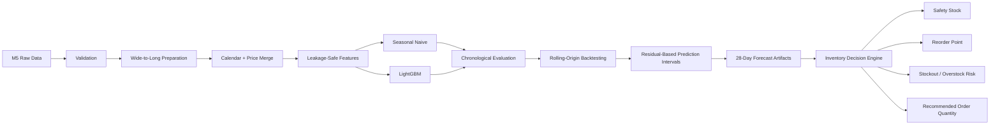
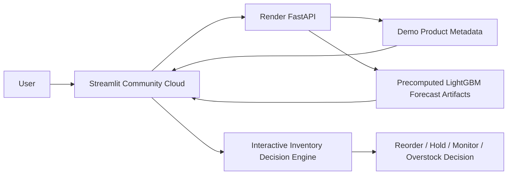

# Retail Demand Forecasting & Inventory Decision Engine

<p align="center">
  <strong>End-to-end retail demand forecasting that turns predictions into inventory decisions.</strong>
</p>

<p align="center">
  Built with real M5 Walmart data, leakage-safe time-series features, LightGBM, rolling-origin backtesting,
  uncertainty intervals, FastAPI, Streamlit, Docker, automated tests, and CI.
</p>

<p align="center">
  <a href="https://retail-demand-forecasting-inventory.streamlit.app/">
    
  </a>
  <a href="https://retail-demand-forecasting-inventory-1.onrender.com/docs">
    
  </a>
  <a href="https://github.com/Alif1642/retail-demand-forecasting-inventory/actions/workflows/ci.yml">
    
  </a>
  
  
  
  
  
</p>

---

## Live Demo

- **Interactive Streamlit Dashboard:** https://retail-demand-forecasting-inventory.streamlit.app/
- **FastAPI Swagger Documentation:** https://retail-demand-forecasting-inventory-1.onrender.com/docs
- **API Health Check:** https://retail-demand-forecasting-inventory-1.onrender.com/health

> The public portfolio deployment uses a lightweight serving architecture suitable for free cloud tiers. Forecasts shown in the deployed demo are real outputs generated by the trained LightGBM pipeline and stored as compact forecast artifacts. Inventory decisions remain interactive.

---

## Overview

Retail forecasting is only useful when it supports an operational decision.

This project builds a complete forecasting workflow around the real **M5 Forecasting — Walmart** dataset and converts SKU/store-level demand predictions into inventory recommendations such as:

- **How much demand is expected over the next 28 days?**
- **How uncertain is that forecast?**
- **Is current inventory likely to stock out?**
- **Is inventory excessive relative to forecast demand?**
- **Where should the reorder point be?**
- **How much should be reordered?**
- **Which SKU/store combinations should be prioritized first?**

The repository is designed as a **portfolio-grade, production-style machine learning project**, not a single exploratory notebook.

---

## Project Highlights

| Capability | Implementation |
|---|---|
| Real-world dataset | M5 Forecasting Walmart retail data |
| Forecast granularity | SKU × store |
| Forecast horizon | 28 days |
| Baseline | 7-day Seasonal Naive |
| ML model | LightGBM |
| Leakage prevention | Lagged demand + shifted rolling windows |
| Validation | Chronological holdout + rolling-origin backtesting |
| Metrics | MAE, WMAPE, RMSSE, Bias |
| Uncertainty | Residual-based prediction intervals |
| Inventory logic | Safety stock, reorder point, reorder quantity |
| Risk layer | Stockout risk + overstock risk |
| API | FastAPI |
| Dashboard | Streamlit + Matplotlib |
| API hosting | Render |
| Dashboard hosting | Streamlit Community Cloud |
| Testing | Python `unittest` |
| Containers | Docker + Docker Compose |
| CI | GitHub Actions |
| Reproducibility | Sample mode + full-data mode |

---

## Verified Results — Local Sample Mode

The following values were generated from a real local pipeline run using:

```text
DATA_MODE=sample
MAX_SERIES=100
FORECAST_HORIZON=28
N_BACKTEST_FOLDS=3
```

### Data Verification

| Item | Verified value |
|---|---:|
| Sample series | 100 |
| Stores represented | 1 |
| Products represented | 100 |
| Prepared rows | 194,100 |
| Raw M5 date range | 2011-01-29 → 2016-06-19 |
| Prepared history end | 2016-05-22 |
| Forecast horizon | 28 days |

### 3-Fold Rolling-Origin Backtest

| Metric | Seasonal Naive | LightGBM | Change |
|---|---:|---:|---:|
| **MAE** | 1.388 | **1.010** | **27.3% lower** |
| **WMAPE** | 1.156 | **0.840** | **27.4% lower** |
| **RMSSE** | 1.086 | **0.864** | **20.4% lower** |
| **Bias** | -0.035 | -0.523 | LightGBM under-forecasts |
| **Interval Coverage** | — | **0.900** | Target ≈ 0.90 |

LightGBM outperformed the Seasonal Naive benchmark on **MAE, WMAPE, and RMSSE in all three folds**.

The negative LightGBM bias is intentionally reported rather than hidden. The verified sample run shows a consistent **under-forecasting tendency**, making bias correction and calibration clear future improvements.

### Validation Snapshot

```text
MAE                    1.0359
WMAPE                  0.8356
RMSSE                  0.8724
Bias                  -0.5464
Interval Coverage      0.9164
Average Interval Width 3.5023
```

> These are **sample-mode verification results**, not official full-M5 benchmark claims.

---

## Example Forecast & Inventory Decision

A verified 28-day forecast was generated for:

```text
HOBBIES_1_001_CA_1
```

Forecast window:

```text
2016-05-23 → 2016-06-19
```

Example inventory-engine smoke test:

| Output | Value |
|---|---:|
| 28-day expected demand | 22.41 |
| Current inventory | 0.00 |
| Safety stock | 5.31 |
| Reorder point | 11.94 |
| Recommended order quantity | 27.72 |
| Stockout risk | **HIGH** |
| Overstock risk | **LOW** |
| Priority score | 69.54 |
| Recommendation | **REORDER** |

The zero inventory value is an explicit test input, not a measured business inventory level.

---

## System Architecture

The project has two related execution paths:

1. a **full local ML pipeline** for training, validation, backtesting, and forecast generation;
2. a **lightweight hosted demo path** optimized for free-tier deployment.

### Full Local ML Pipeline



### Hosted Portfolio Demo



### Why the hosted demo uses forecast artifacts

The complete local forecasting pipeline loads historical data, model artifacts, calendar data, price data, and recursive time-series features. That is appropriate for development and offline forecasting, but unnecessarily heavy for a free-tier portfolio deployment.

The hosted demo therefore serves **real pre-generated LightGBM forecasts** through FastAPI, while keeping inventory inputs and decisions interactive in Streamlit. This reduces cloud memory and CPU usage without presenting fabricated predictions.

---

## Hosted Demo Scope

The public demo currently exposes **7 SKU/store forecast series**:

```text
HOBBIES_1_001_CA_1
HOBBIES_1_002_CA_1
HOBBIES_1_003_CA_1
HOBBIES_1_004_CA_1
HOBBIES_1_005_CA_1
HOBBIES_1_006_CA_1
HOBBIES_1_007_CA_1
```

Each series has a real 28-day forecast artifact generated by the trained LightGBM pipeline.

The hosted dashboard provides:

- state / store / category / department filtering,
- SKU/store drilldown,
- 28-day demand forecast,
- prediction intervals,
- configurable current inventory,
- configurable lead time,
- configurable service level,
- holding-cost and stockout-cost inputs,
- safety stock,
- reorder point,
- recommended order quantity,
- stockout risk,
- overstock risk,
- priority score,
- final inventory recommendation,
- model-performance metrics.

---

## Repository Structure

```text
retail-demand-forecasting-inventory/
│
├── api/                         # FastAPI application and routes
├── dashboard/
│   ├── streamlit_app.py         # Hosted Streamlit dashboard
│   └── requirements.txt         # Lightweight dashboard dependencies
│
├── demo/
│   ├── products.csv             # Metadata for deployed demo series
│   └── forecasts/               # Precomputed LightGBM forecast artifacts
│
├── data/
│   ├── raw/m5/                  # M5 source / selected deployment data
│   ├── processed/               # Prepared sample data
│   ├── features/                # Generated feature artifacts
│   └── predictions/             # Forecast/inventory outputs
│
├── docs/                        # Architecture and methodology docs
├── models/                      # LightGBM model artifacts
├── notebooks/                   # Eight analysis notebooks
├── results/
│   ├── metrics/
│   ├── figures/
│   └── reports/
│
├── scripts/                     # CLI pipeline entry points
├── src/
│   ├── data/
│   ├── evaluation/
│   ├── features/
│   ├── forecasting/
│   ├── hierarchy/
│   ├── inventory/
│   └── utils/
│
├── tests/                       # unittest test suite
├── .github/workflows/ci.yml     # Continuous integration
├── .dockerignore
├── .env.example
├── .gitignore
├── Dockerfile
├── docker-compose.yml
├── requirements.txt
├── README.md
└── LICENSE
```

---

## Data & Artifact Policy

The repository is designed to keep the **full M5 dataset** out of ordinary Git history while still supporting a usable public demo.

### Full local pipeline

For a complete local run, place the original M5 files under:

```text
data/raw/m5/
```

Typical source files:

```text
calendar.csv
sales_train_validation.csv
sales_train_evaluation.csv
sell_prices.csv
sample_submission.csv
```

### Hosted portfolio deployment

The public repository contains selected lightweight/sample artifacts required for the deployed demonstration, including:

- demo product metadata,
- pre-generated forecast CSVs,
- selected sample/deployment data,
- model/evaluation artifacts required by the project workflow.

The full raw M5 dataset is not intended to be committed to the repository.

---

## Data Pipeline

The M5 sales table is stored in wide format (`d_1`, `d_2`, …). The preparation pipeline converts it into forecasting-friendly long format:

```text
series_id
item_id
dept_id
cat_id
store_id
state_id
date
demand
```

It then merges:

1. sales history,
2. calendar information,
3. event/SNAP information,
4. weekly selling prices.

Prepared sample data is written to:

```text
data/processed/m5_prepared.csv
```

---

## Leakage-Safe Feature Engineering

Time-series leakage prevention is a core design constraint.

### Demand Lags

```text
lag_1
lag_2
lag_3
lag_7
lag_14
lag_28
lag_56
```

### Rolling Features

```text
rolling_mean_7
rolling_mean_14
rolling_mean_28
rolling_mean_56
rolling_std_7
rolling_std_28
```

Rolling statistics use shifted history:

```python
series.shift(1).rolling(...)
```

This prevents the current target and future demand from leaking into the feature window.

### Calendar Features

- day of week,
- week,
- month,
- quarter,
- year,
- weekend flag,
- month-start / month-end,
- events,
- SNAP indicators.

### Price Features

- current price,
- previous price,
- absolute price change,
- percentage price change,
- rolling average price,
- relative price.

Price features are treated as predictive inputs. The project does **not** make causal claims about price effects.

---

## Forecasting Strategy

### 1. Seasonal Naive Baseline

A 7-day seasonal pattern is used as the benchmark.

For horizons beyond one week, the historical weekly pattern is repeated without reading future actual demand.

### 2. LightGBM

LightGBM is trained on lag, rolling, calendar, event, hierarchy, and price features.

The project deliberately avoids random shuffled train/test splitting.

### 3. Chronological Validation

```text
Past ----------------------------------------------> Future

[                    Training                    ][Validation]
```

### 4. Rolling-Origin Backtesting

```text
Fold 1: [ Training ---------------- ] [28-day validation]
Fold 2: [ Training ---------------------- ] [28-day validation]
Fold 3: [ Training ---------------------------- ] [28-day validation]
```

This tests the model across multiple forecast origins instead of relying on one split.

### 5. Recursive Forecasting

For every future day:

```text
available history
      ↓
build features
      ↓
predict next day
      ↓
append prediction
      ↓
build next-day features
      ↓
repeat
```

Actual future demand is never used during inference.

---

## Evaluation Metrics

### MAE

```text
mean(|actual - forecast|)
```

### WMAPE

```text
sum(|actual - forecast|) / sum(|actual|)
```

### Forecast Bias

```text
sum(forecast - actual) / sum(actual)
```

### RMSSE

RMSSE is implemented with historical scaling to compare forecast errors against the scale of each series.

The repository intentionally does **not** claim official WRMSSE unless the complete official M5 hierarchy-weighting procedure is implemented.

---

## Prediction Intervals

Point forecasts alone do not communicate uncertainty.

This project derives empirical intervals from historical validation residuals and returns:

```text
lower_bound
forecast
upper_bound
```

The pipeline evaluates:

- interval coverage,
- average interval width.

Default target interval:

```text
90%
```

---

## Inventory Decision Engine

Forecasts are translated into operational inventory recommendations.

### Inputs

```text
forecast
prediction interval
current inventory
lead time
service level
holding cost
stockout cost
```

### Outputs

```text
expected demand
expected lead-time demand
safety stock
reorder point
recommended order quantity
stockout risk
overstock risk
priority score
recommendation
```

Possible recommendations:

```text
REORDER
MONITOR
HOLD
OVERSTOCK
```

### Safety Stock

```text
Safety Stock = Z × Demand Std × sqrt(Lead Time)
```

Supported service levels:

| Service level | Z |
|---|---:|
| 90% | 1.282 |
| 95% | 1.645 |
| 99% | 2.326 |

### Reorder Point

```text
Reorder Point =
Expected Lead-Time Demand + Safety Stock
```

The decision engine combines forecast demand, uncertainty, current inventory, and operational assumptions instead of treating forecasting as an isolated modeling task.

---

## FastAPI Service

### Live API

**Swagger UI**

```text
https://retail-demand-forecasting-inventory-1.onrender.com/docs
```

**Health**

```text
https://retail-demand-forecasting-inventory-1.onrender.com/health
```

### Core Deployed Endpoints

| Method | Endpoint | Purpose |
|---|---|---|
| GET | `/health` | Service health |
| GET | `/products` | Available demo product/series metadata |
| GET | `/forecast/{series_id}` | Return forecast for one deployed demo series |
| POST | `/forecast` | Forecast lookup using request payload |

Example:

```text
GET /forecast/HOBBIES_1_001_CA_1?horizon=28
```

### Run Locally

```powershell
hypercorn api.main:app --bind 0.0.0.0:8000
```

Local documentation:

```text
http://127.0.0.1:8000/docs
```

> The Render-hosted demo is optimized for free-tier resources and serves precomputed LightGBM forecast artifacts instead of executing the full recursive forecasting pipeline on every request.

---

## Streamlit Dashboard

### Live Dashboard

```text
https://retail-demand-forecasting-inventory.streamlit.app/
```

The deployed Streamlit app communicates with the Render FastAPI backend for product metadata and forecast retrieval.

Inventory decisions are then calculated interactively using the project's reusable inventory decision logic.

### Run Locally

```powershell
streamlit run dashboard/streamlit_app.py
```

Local URL:

```text
http://localhost:8501
```

---

## Quick Start — Windows / PowerShell

### 1. Clone

```powershell
git clone https://github.com/Alif1642/retail-demand-forecasting-inventory.git
cd retail-demand-forecasting-inventory
```

### 2. Create Environment

```powershell
python -m venv .venv
Set-ExecutionPolicy -Scope Process -ExecutionPolicy Bypass
.\.venv\Scripts\Activate.ps1
```

### 3. Install Dependencies

```powershell
python -m pip install --upgrade pip
python -m pip install -r requirements.txt
```

### 4. Add Full M5 Dataset for a Complete Local Run

Place the original M5 files inside:

```text
data/raw/m5/
```

### 5. Validate

```powershell
python scripts/validate_data.py
```

### 6. Prepare Data

```powershell
python scripts/prepare_data.py
```

### 7. Train

```powershell
python scripts/train_model.py
```

### 8. Backtest

```powershell
python scripts/run_backtest.py
```

### 9. Forecast

```powershell
python scripts/generate_forecast.py --series-id HOBBIES_1_001_CA_1
```

### 10. Inventory Recommendation

```powershell
python scripts/run_inventory_engine.py
```

For real current-inventory inputs:

```powershell
python scripts/run_inventory_engine.py --inventory-file path\to\inventory.csv
```

Expected optional inventory columns:

```text
series_id,current_inventory,lead_time,service_level,holding_cost,stockout_cost
```

---

## Jupyter Notebooks

The repository contains eight analysis notebooks that call reusable project functions from `src/`:

| Notebook | Focus |
|---|---|
| `01_data_understanding.ipynb` | Dataset understanding and EDA |
| `02_data_preparation.ipynb` | Validation and transformation |
| `03_feature_engineering.ipynb` | Leakage-safe feature engineering |
| `04_baseline_forecasting.ipynb` | Seasonal Naive benchmark |
| `05_lightgbm_forecasting.ipynb` | LightGBM training and forecasting |
| `06_time_series_backtesting.ipynb` | Rolling-origin evaluation |
| `07_inventory_decision_engine.ipynb` | Inventory recommendations |
| `08_model_evaluation.ipynb` | Final evaluation and comparison |

Optional notebook setup:

```powershell
pip install jupyter notebook ipykernel
python -m ipykernel install --user --name retail-forecast-env --display-name "Python (Retail Forecast)"
```

---

## Testing

The tests use small manually-created DataFrames, so the full M5 dataset is not required.

Run:

```powershell
python -m unittest discover -v
```

Verified local result:

```text
Ran 11 tests
OK
```

Coverage includes:

- data loading,
- sample-mode behavior,
- lag generation,
- leakage-safe rolling statistics,
- metrics,
- zero-denominator handling,
- Seasonal Naive forecasting,
- chronological backtesting,
- safety-stock calculation,
- reorder logic,
- API application/health behavior.

---

## Docker

The Linux container installs the GNU OpenMP runtime required by LightGBM.

Build and run:

```powershell
docker compose up --build
```

Services:

```text
API       → http://localhost:8000
Dashboard → http://localhost:8501
```

Check:

```powershell
docker compose ps
```

Stop:

```powershell
docker compose down
```

The Render deployment uses the repository Dockerfile and binds the service to the platform-provided port.

---

## Continuous Integration

GitHub Actions performs automated checks on configured CI runs, including:

- dependency installation,
- Python compilation,
- unit tests,
- key-module imports,
- application smoke checks.

Workflow:

```text
.github/workflows/ci.yml
```

---

## Deployment

### FastAPI Backend

Hosted on **Render**:

```text
https://retail-demand-forecasting-inventory-1.onrender.com
```

The deployment uses a lightweight API serving path to stay within free-tier resource constraints.

### Streamlit Frontend

Hosted on **Streamlit Community Cloud**:

```text
https://retail-demand-forecasting-inventory.streamlit.app/
```

The dashboard uses:

```text
API_BASE_URL = https://retail-demand-forecasting-inventory-1.onrender.com
```

### Deployment Flow

```text
GitHub
  │
  ├──> Render → FastAPI backend
  │
  └──> Streamlit Community Cloud → Dashboard
                                     │
                                     └──> Render API
```

---

## Reproducibility & Repository Hygiene

The repository keeps development and deployment concerns separate.

### Excluded or local-only content

The full raw M5 dataset, virtual environments, secrets, caches, and other unnecessarily large local artifacts should remain outside normal Git history.

### Included deployment artifacts

Small selected artifacts required for the public portfolio demo are intentionally versioned so the hosted application can run reliably without downloading or rebuilding the full M5 pipeline during startup.

This is a pragmatic portfolio deployment choice. A larger production system would normally use object storage, a model registry, a feature store, or another external artifact service.

---

## Known Limitations

- Full M5 wide-to-long expansion can require substantial memory.
- Sample-mode metrics are not a substitute for full-data benchmarking.
- LightGBM shows negative forecast bias in the verified sample run.
- Residual-based prediction intervals are empirical rather than fully probabilistic.
- Inventory recommendations depend on user-supplied inventory, lead-time, service-level, and cost assumptions.
- Current hierarchy support focuses on aggregation/basic bottom-up behavior rather than advanced reconciliation optimization.
- Future selling-price information should only be used when operationally known or planned.
- The public demo exposes seven pre-generated SKU/store forecast series rather than running the entire M5 universe online.
- The hosted API serves precomputed LightGBM forecast artifacts to remain reliable on free-tier infrastructure.
- Free cloud services may take longer to respond after periods of inactivity.

---

## Roadmap

Potential next improvements:

- full-dataset partitioned processing,
- richer chronological hyperparameter tuning,
- bias correction / forecast calibration,
- segment-specific prediction intervals,
- supplier constraints,
- minimum-order quantities,
- service-level optimization,
- advanced hierarchical reconciliation,
- data-quality monitoring,
- forecast drift monitoring,
- scheduled retraining,
- model registry / artifact storage,
- cloud object storage,
- asynchronous batch forecasting,
- production monitoring and alerting.

---

## Skills Demonstrated

### Data Science

- time-series forecasting,
- leakage-safe feature engineering,
- chronological model evaluation,
- uncertainty estimation,
- rolling-origin backtesting.

### Machine Learning Engineering

- modular Python architecture,
- model persistence,
- recursive forecasting pipeline,
- reproducibility,
- API serving,
- automated testing,
- CI.

### Data / Business Analytics

- demand analysis,
- forecast interpretation,
- inventory planning,
- stockout / overstock risk,
- operational decision support.

### Software Engineering

- FastAPI,
- Streamlit,
- Docker,
- Git / GitHub,
- REST APIs,
- automated testing,
- documentation,
- cloud deployment.

---

## Resume-Ready Description

> Developed an end-to-end SKU/store retail demand forecasting system using leakage-safe lag and rolling features, LightGBM, chronological validation, and rolling-origin backtesting for 28-day demand prediction.

> Translated forecast uncertainty into inventory decisions including safety stock, reorder points, stockout/overstock risk, priority scoring, and recommended order quantities, exposed through FastAPI and an interactive Streamlit dashboard with Docker, automated tests, CI, and cloud deployment.

---

## Interview Talking Points

- Why random train/test splitting is inappropriate for demand forecasting.
- How shifted rolling windows prevent time-series leakage.
- Why a Seasonal Naive model is a useful retail baseline.
- How rolling-origin backtesting gives a stronger estimate than one holdout split.
- Why forecast bias matters even when MAE improves.
- How prediction intervals feed directly into safety stock and reorder logic.
- Why the hosted demo serves precomputed model outputs on free-tier infrastructure.
- How the same repository supports both a full local ML workflow and a lightweight deployed application.

---

## Author

**Md. Alif Hossen**

GitHub: [@Alif1642](https://github.com/Alif1642)

---

## License

This project is available under the **MIT License**.

---

<p align="center">
  <strong>Forecast demand. Quantify uncertainty. Turn predictions into inventory decisions.</strong>
</p>
