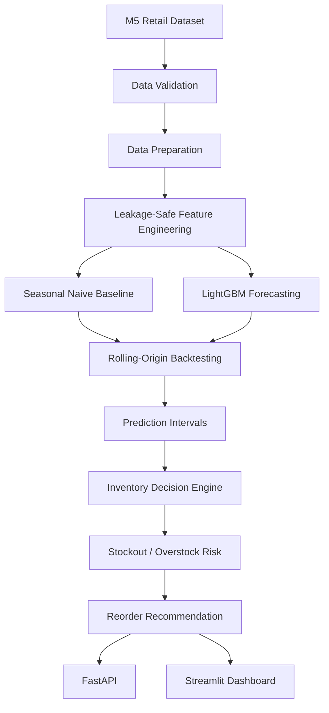

# Architecture

The project is organized as a production-style Python repository rather than a notebook-only analysis.

`src/` contains reusable production logic. `scripts/` provides command-line workflows, `api/` exposes service endpoints, `dashboard/` provides an interactive view, and `notebooks/` demonstrates each stage by importing production functions.
